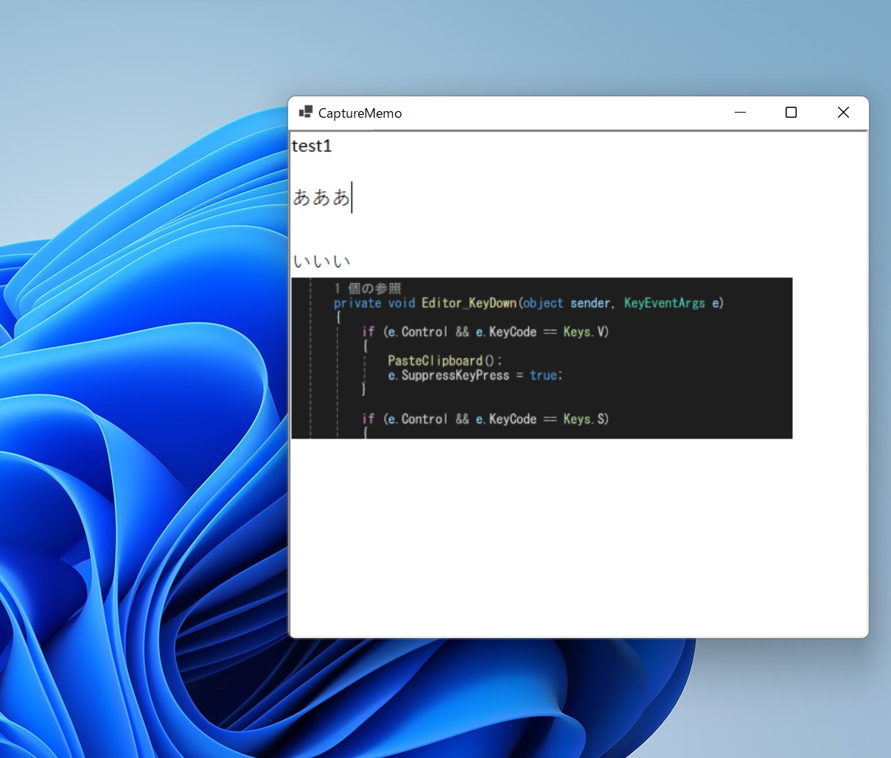

# CaptureMemo

常にウインドウの最前面においておけるメモツールです。  
テキストも画像も貼り付けできます。  

本ソフトウェアはフリーソフトですので無料で使用することができます。  
     

---

## 動作環境
Windows 11 / Windows 10

---

## 使い方
・常に最前面においておけます。  
・テキストを入力できます。  
・スクショを貼り付けできます。  
・Ctrl + マウスのスクロールで拡大縮小できます。  
・Ctrl + s で入力内容を画像として保存できます。  

## 免責事項

本ソフトウェアを使用したことによって生じたいかなる損害についても、作者は一切の責任を負いません。  
自己責任でご利用ください。

## ライセンス・利用条件
本ソフトウェアはフリーソフトです。  
MIT License のもとで公開されています。  
**個人利用・商用利用を問わず、無料で使用することができます。**
ただし、本ソフトウェアを使用したことによって生じたいかなる損害についても、作者は一切の責任を負いません。  
自己責任でご利用ください。  

## 応援について

もしこのソフトウェアが役に立ったと感じたら、
GitHub の ⭐ Star や 👀 Watch を付けてもらえるととても励みになります！

フィードバックや Issue も大歓迎です。
