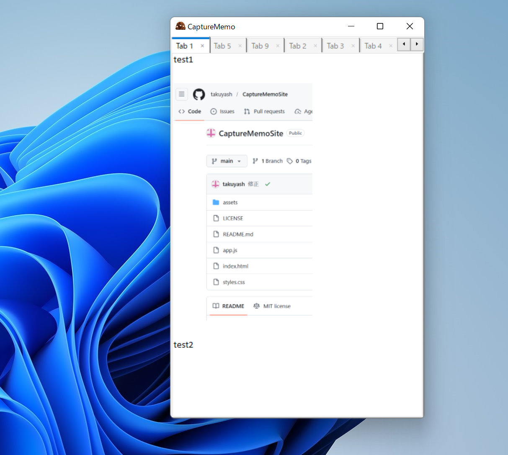

# CaptureMemo
 
CaptureMemoは作業中にスクショや画像、テキストを横において常にすぐ見られる一時的なメモアプリです。  
常に最前面にあるため、新しく別のアプリのウインドウを立ち上げてもアプリを探して最前面に持ってくる必要がありません。  

本ソフトウェアはフリーソフトですので無料で使用することができます。  
     

---

## 動作環境
Windows 11 / Windows 10。  

---

## 使い方
・常に最前面においておけます。  
・テキストを入力できます。  
・スクショを貼り付けできます。   
・画像ファイル、テキストファイルをドラッグアンドドロップでファイルの内容を表示できます。  
・Ctrl + マウスのスクロールで拡大縮小できます。  
・Ctrl + S で入力内容を画像として保存できます。  
・タブを10個作ることができます。  
・タブは右クリックで並び替え、名前の変更、複製ができます。  
・Ctrl + F でタブを跨いで検索ができます。  
・入力内容はローカルに自動保存されるためアプリを間違って閉じても安心です(保存はjsonファイルに5秒間隔)  

## 免責事項

本ソフトウェアを使用したことによって生じたいかなる損害についても、作者は一切の責任を負いません。  
自己責任でご利用ください。  

## ライセンス・利用条件
本ソフトウェアはフリーソフトです。  
MIT License のもとで公開されています。  
**個人利用・商用利用を問わず、無料で使用することができます。**  
ただし、本ソフトウェアを使用したことによって生じたいかなる損害についても、作者は一切の責任を負いません。  
自己責任でご利用ください。  

## 応援について

もしこのソフトウェアが役に立ったと感じたら、  
GitHub の ⭐ Star や 👀 Watch を付けてもらえるととても励みになります！。  

フィードバックや Issue も大歓迎です。  

# CaptureMemo

CaptureMemo is a temporary memo application that lets you keep screenshots, images, and text visible beside your work at all times.  

Since the window always stays on top, you don't need to search for the app and bring it to the front every time you open another application.  

This software is freeware and can be used free of charge.  

---

## System Requirements

Windows 11 / Windows 10  

---

## Features

* Always stays on top of other windows.
* Supports text input.
* Allows pasting screenshots directly into the memo area.
* Displays the contents of image files and text files via drag-and-drop.
* Zoom in and out using **Ctrl + Mouse Wheel**.
* Save the current content as an image using **Ctrl + S**.
* Create up to 10 tabs.
* Right-click a tab to rename, duplicate, or reorder it.
* Search across all tabs using **Ctrl + F**.
* Contents are automatically saved locally, so you don't have to worry about losing data if the application is accidentally closed.

  * Data is saved to a JSON file every 5 seconds.

---

## Disclaimer

The author assumes no responsibility for any damages or losses resulting from the use of this software.  

Use this software at your own risk.  

---

## License

This software is released under the MIT License.  

**It is free to use for both personal and commercial purposes.**

However, the author assumes no responsibility for any damages or losses resulting from the use of this software.  

Use this software at your own risk.  

---

## Support

If you find this software useful, please consider giving it a ⭐ Star or 👀 Watch on GitHub.  

Feedback, suggestions, and issue reports are always welcome.

